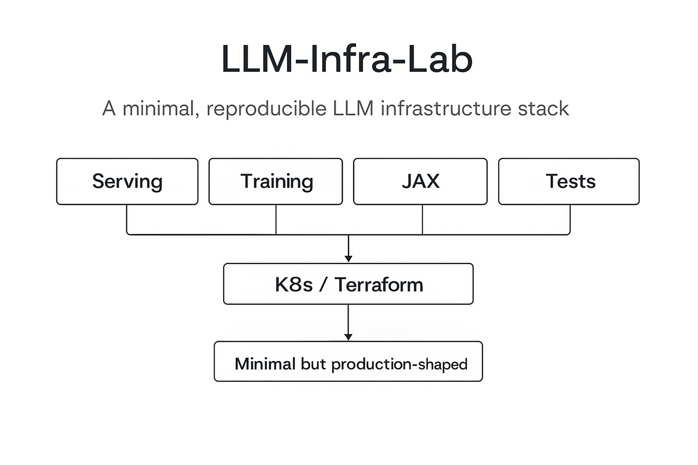

# 🚀 LLM-Infra-Lab
A minimal, reproducible LLM infrastructure stack — designed so anyone can understand the *entire LLM pipeline* in under an hour.

This project is for engineers who want to learn:

- How fast inference engines (like vLLM) organize KV caches & batching  
- How distributed training (FSDP, JAX pmap) is wired internally  
- How serving layers + infra (K8s / Terraform) fit around an LLM  
- How to test the whole thing on a *single CPU-only laptop*

No GPUs required. No massive models.  
Just clean, readable, production-shaped code — the smallest possible LLM infra stack you can learn from.

## ⭐ Why this exists
Most LLM repos are either too huge to read, or too toy-like.  
This lab sits in the middle — small enough to understand, real enough to learn from.

You get:

- A working KV-cache engine  
- A working FastAPI inference server  
- A working FSDP-style training step  
- A working JAX pmap example  
- A working K8s/Terraform infra skeleton  
- A complete pytest suite verifying everything  

Everything is minimal, but nothing is fake.

## 🧩 Architecture Overview

<p align="center">
  
</p>

## 🔥 Try it

```bash
git clone https://github.com/REICHIYAN/llm_infra_lab.git
cd llm_infra_lab
pip install -r requirements.txt
PYTHONPATH=. pytest -q
```

## What’s inside

```
llm_infra_lab/
├── serving/          
├── training/         
├── jax/              
├── tests/            
├── k8s/              
├── terraform/        
└── scripts/          
```

## Design Principles
- CPU-first reproducibility
- Minimal, not trivial
- Production-shaped APIs
- Tests = executable documentation

## ⭐ Star the repo
If this project helps you understand LLM infra, please consider starring it.
